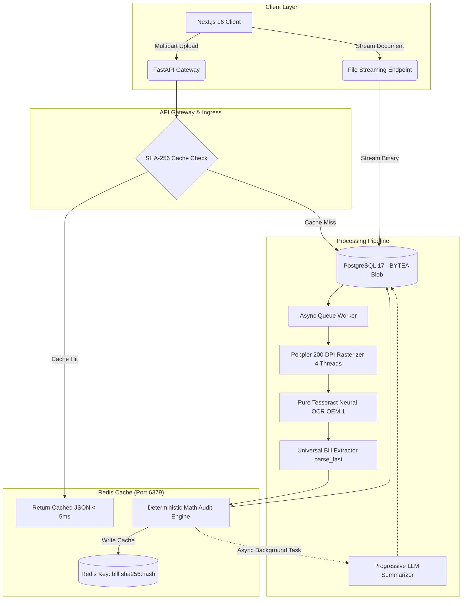

# JouleWise System Architecture & Design Document (HLD / LLD)

This document details the high-level architecture, low-level component designs, mathematical verification formulation, and case studies for the JouleWise utility bill extraction platform.

---

## 1. High-Level Design (HLD)

### 1.1 Architectural Objectives

1. **Deterministic Extraction & Verification**:
   Ensure utility bills are parsed with mathematically verifiable accuracy. OCR readings must reconcile with net charges, consumption multipliers, and power factor bounds.
2. **Zero Local Disk Dependence**:
   Store every document binary directly in PostgreSQL (`BYTEA`) so that application containers remain completely stateless without mounting local shared disks or volume maps.
3. **Resilient Offline Extraction**:
   Ensure core extraction and math verification operate independently of third-party cloud APIs or LLMs. If Gemini or Ollama is unavailable, the pipeline completes using pure Tesseract OCR and deterministic heuristics.
4. **Sub-5ms Cache Resolution**:
   Prevent redundant OCR processing on duplicate or consecutive requests using SHA-256 keyed Redis caching.

### 1.2 System Topology



### 1.3 Request Lifecycle & Staged Pipeline

1. **Ingress & Hashing**:
   - Client sends multipart file payload to `/api/v1/bills/upload` or `/api/v1/bills/bulk-upload`.
   - The server computes the SHA-256 digest of the raw bytes.
2. **Cache Resolution**:
   - The worker checks Redis for key `bill:sha256:{hash}`.
   - If present, the stored verified bill payload is returned immediately with HTTP 202 (`retrieved from cache`).
3. **Database Blob Persistence**:
   - If not in cache, a new `Bill` record is inserted with `file_data = contents` directly into PostgreSQL.
   - The record status is set to `QUEUED`, and the generated UUID is placed on `asyncio.Queue`.
4. **High-Speed Rasterization & Single-Pass Neural OCR (~2.2s)**:
   - The worker reads `bill.file_data` from PostgreSQL.
   - For PDF documents, Poppler (`pdf2image.convert_from_bytes`) renders pages at 200 DPI with 4 parallel worker threads and converts images to 8-bit grayscale.
   - Tesseract OCR extracts token coordinates, confidence scores, and layout text in a single pass (`--oem 1`).
5. **Document Classification Guardrail**:
   - Before parsing, the text is evaluated against negative manual/datasheet signatures and positive electricity billing signals.
   - Non-bill technical documents are rejected with `REJECTED_NON_BILL`.
6. **Fast Heuristic Parsing & Mathematical Audit**:
   - Multi-anchor regex heuristics extract Consumer Name, Account Number, Due Date, Active Energy Units, Net Amount Due, and Meter Registers in < 50ms.
   - The mathematical audit engine verifies consumption multipliers, power factor sanity, and financial sums.
   - The bill is committed with status `VERIFIED` and cached in Redis. The frontend unblurs immediately.
7. **Decoupled Progressive AI Summarization**:
   - An asynchronous background task invokes Gemini 2.5 Flash or local Ollama (Llama 3.2).
   - If available, the plain-English summary is enriched in the background. If offline, a deterministic summary is constructed immediately without delaying the user.
8. **CSV Exports**:
   - `GET /api/v1/bills/export/csv` generates structured CSV reports for the entire bill collection.
   - `GET /api/v1/bills/{id}/export/csv` generates detailed CSV audit reports with register breakdowns.

---

## 2. Low-Level Design (LLD)

### 2.1 Database Schema (PostgreSQL 17)

```sql
CREATE TABLE bills (
    id VARCHAR(36) PRIMARY KEY,
    discom_code VARCHAR(50) INDEX,
    discom_name VARCHAR(200),
    consumer_number VARCHAR(100) INDEX,
    account_number VARCHAR(100),
    consumer_name VARCHAR(255),
    billing_address TEXT,
    bill_number VARCHAR(100) INDEX,
    bill_date DATE,
    billing_period_start DATE,
    billing_period_end DATE,
    due_date DATE,
    tariff_category VARCHAR(100),
    sanctioned_load_kw FLOAT,
    contract_demand_kva FLOAT,
    billed_demand_kva FLOAT,
    power_factor FLOAT,
    total_units_kwh FLOAT,
    total_units_kvah FLOAT,
    total_current_charges FLOAT,
    net_amount_due FLOAT,
    amount_after_due_date FLOAT,
    file_data BYTEA NOT NULL,
    file_name VARCHAR(255) NOT NULL,
    mime_type VARCHAR(100) NOT NULL DEFAULT 'application/pdf',
    file_sha256 VARCHAR(64) NOT NULL INDEX,
    status VARCHAR(50) NOT NULL DEFAULT 'QUEUED' INDEX,
    is_valid_bill BOOLEAN NOT NULL DEFAULT TRUE,
    validation_error VARCHAR(500),
    bill_summary TEXT,
    confidence_score FLOAT NOT NULL DEFAULT 1.0,
    is_math_verified BOOLEAN NOT NULL DEFAULT FALSE,
    verification_details JSON,
    bounding_boxes JSON,
    raw_extracted_text TEXT,
    created_at TIMESTAMP WITH TIME ZONE NOT NULL,
    updated_at TIMESTAMP WITH TIME ZONE NOT NULL
);

CREATE TABLE meter_readings (
    id VARCHAR(36) PRIMARY KEY,
    bill_id VARCHAR(36) NOT NULL REFERENCES bills(id) ON DELETE CASCADE,
    meter_number VARCHAR(100) NOT NULL,
    reading_type VARCHAR(50) NOT NULL,
    previous_reading FLOAT NOT NULL,
    current_reading FLOAT NOT NULL,
    difference FLOAT NOT NULL,
    multiplying_factor FLOAT NOT NULL DEFAULT 1.0,
    consumed_units FLOAT NOT NULL,
    created_at TIMESTAMP WITH TIME ZONE NOT NULL,
    updated_at TIMESTAMP WITH TIME ZONE NOT NULL
);

CREATE TABLE bill_line_items (
    id VARCHAR(36) PRIMARY KEY,
    bill_id VARCHAR(36) NOT NULL REFERENCES bills(id) ON DELETE CASCADE,
    category VARCHAR(50) NOT NULL,
    description VARCHAR(255) NOT NULL,
    rate FLOAT,
    quantity FLOAT,
    amount FLOAT NOT NULL,
    created_at TIMESTAMP WITH TIME ZONE NOT NULL,
    updated_at TIMESTAMP WITH TIME ZONE NOT NULL
);
```

### 2.2 Mathematical Verification Formulation

The verification engine executes 4 deterministic audit rules:

#### Rule 1: Meter Consumption Reconciliation
For every meter register $i \in \{1, \dots, n\}$:
$$\Delta_i = Current\_Reading_i - Previous\_Reading_i$$
$$Calculated\_Units_i = \Delta_i \times Multiplying\_Factor_i$$
$$\text{Tolerance Check: } |Calculated\_Units_i - Reported\_Units_i| \le \epsilon \quad (\epsilon = 1.0)$$

#### Rule 2: Active Energy Summation
For multi-register meters (e.g. TOD peak/off-peak):
$$\sum_{i=1}^n Calculated\_Units_{i, \text{kWh}} = Total\_Units_{kwh} \pm \epsilon$$

#### Rule 3: Financial Net Due Balance
$$\sum_{j=1}^m Line\_Item\_Amount_j = Total\_Current\_Charges \pm \epsilon_{financial}$$
Where $\epsilon_{financial} = 2.0$ to account for state rounding rules (e.g. "Say Rs." truncation).

#### Rule 4: Power Factor Bounds Check
$$0.0 \le Average\_Power\_Factor \le 1.0$$
Values exceeding $1.0$ indicate register column alignment errors or decimal point shift.
