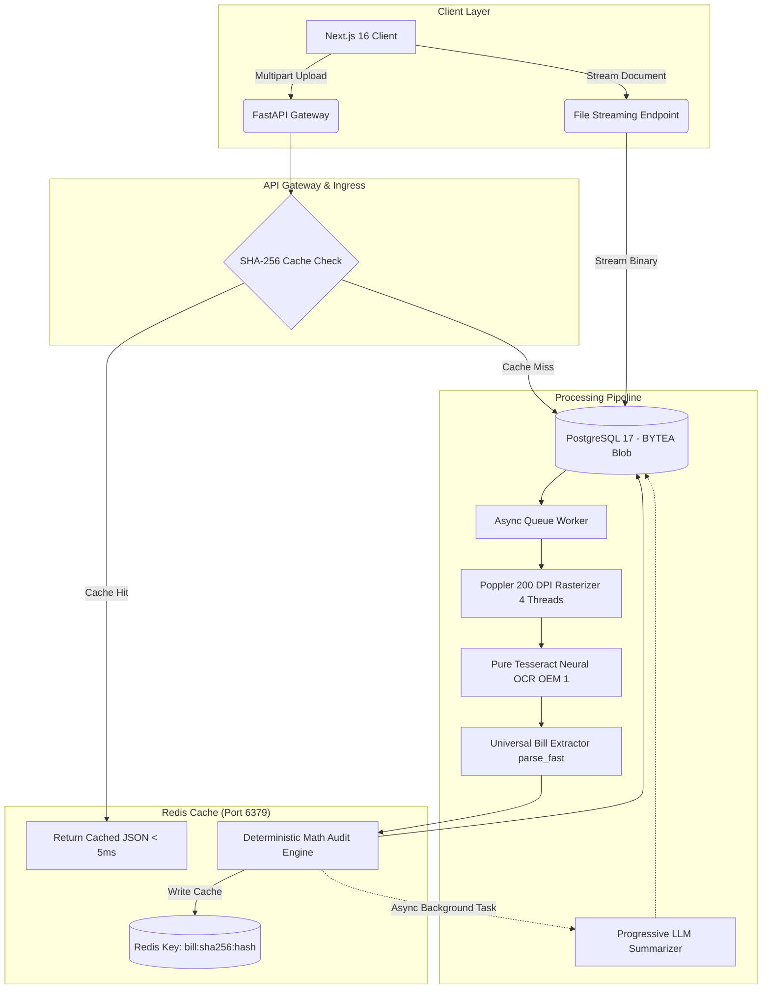

# JouleWise System Architecture & Design Document (HLD / LLD)

This document details the high-level architecture, low-level component designs, mathematical verification formulation, and case studies for the JouleWise utility bill extraction platform.

---

## 1. High-Level Design (HLD)

### 1.1 Architectural Objectives

1. **Deterministic Extraction & Verification**:
   Ensure utility bills are parsed with mathematically verifiable accuracy. OCR readings must reconcile with net charges, consumption multipliers, and power factor bounds.
2. **Zero Local Disk Dependence**:
   Store every document binary directly in PostgreSQL (`BYTEA`) so that application containers remain completely stateless without mounting local shared disks or volume maps.
3. **Resilient Offline Extraction**:
   Ensure core extraction and math verification operate independently of third-party cloud APIs or LLMs. If Gemini or Ollama is unavailable, the pipeline completes using pure Tesseract OCR and deterministic heuristics.
4. **Sub-5ms Cache Resolution**:
   Prevent redundant OCR processing on duplicate or consecutive requests using SHA-256 keyed Redis caching.

### 1.2 System Topology



### 1.3 Request Lifecycle & Staged Pipeline

1. **Ingress & Hashing**:
   - Client sends multipart file payload to `/api/v1/bills/upload` or `/api/v1/bills/bulk-upload`.
   - The server computes the SHA-256 digest of the raw bytes.
2. **Cache Resolution**:
   - The worker checks Redis for key `bill:sha256:{hash}`.
   - If present, the stored verified bill payload is returned immediately with HTTP 202 (`retrieved from cache`).
3. **Database Blob Persistence**:
   - If not in cache, a new `Bill` record is inserted with `file_data = contents` directly into PostgreSQL.
   - The record status is set to `QUEUED`, and the generated UUID is placed on `asyncio.Queue`.
4. **High-Speed Rasterization & Single-Pass Neural OCR (~2.2s)**:
   - The worker reads `bill.file_data` from PostgreSQL.
   - For PDF documents, Poppler (`pdf2image.convert_from_bytes`) renders pages at 200 DPI with 4 parallel worker threads and converts images to 8-bit grayscale.
   - Tesseract OCR extracts token coordinates, confidence scores, and layout text in a single pass (`--oem 1`).
5. **Document Classification Guardrail**:
   - Before parsing, the text is evaluated against negative manual/datasheet signatures and positive electricity billing signals.
   - Non-bill technical documents are rejected with `REJECTED_NON_BILL`.
6. **Fast Heuristic Parsing & Mathematical Audit**:
   - Multi-anchor regex heuristics extract Consumer Name, Account Number, Due Date, Active Energy Units, Net Amount Due, and Meter Registers in < 50ms.
   - The mathematical audit engine verifies consumption multipliers, power factor sanity, and financial sums.
   - The bill is committed with status `VERIFIED` and cached in Redis. The frontend unblurs immediately.
7. **Decoupled Progressive AI Summarization**:
   - An asynchronous background task invokes Gemini 2.5 Flash or local Ollama (Llama 3.2).
   - If available, the plain-English summary is enriched in the background. If offline, a deterministic summary is constructed immediately without delaying the user.
8. **CSV Exports**:
   - `GET /api/v1/bills/export/csv` generates structured CSV reports for the entire bill collection.
   - `GET /api/v1/bills/{id}/export/csv` generates detailed CSV audit reports with register breakdowns.

---

## 2. Low-Level Design (LLD)

### 2.1 Database Schema (PostgreSQL 17)

```sql
CREATE TABLE bills (
    id VARCHAR(36) PRIMARY KEY,
    discom_code VARCHAR(50) NOT NULL INDEX,
    discom_name VARCHAR(200) NOT NULL,
    consumer_number VARCHAR(100) NOT NULL INDEX,
    account_number VARCHAR(100),
    consumer_name VARCHAR(255) NOT NULL,
    billing_address TEXT,
    bill_number VARCHAR(100) NOT NULL INDEX,
    bill_date DATE,
    billing_period_start DATE,
    billing_period_end DATE,
    due_date DATE,
    tariff_category VARCHAR(100),
    sanctioned_load_kw FLOAT,
    contract_demand_kva FLOAT,
    billed_demand_kva FLOAT,
    power_factor FLOAT,
    total_units_kwh FLOAT NOT NULL DEFAULT 0.0,
    total_units_kvah FLOAT,
    total_current_charges FLOAT NOT NULL DEFAULT 0.0,
    net_amount_due FLOAT NOT NULL DEFAULT 0.0,
    amount_after_due_date FLOAT,
    file_data BYTEA NOT NULL,
    file_name VARCHAR(255) NOT NULL,
    mime_type VARCHAR(100) NOT NULL DEFAULT 'application/pdf',
    file_sha256 VARCHAR(64) NOT NULL INDEX,
    status VARCHAR(50) NOT NULL DEFAULT 'QUEUED' INDEX,
    is_valid_bill BOOLEAN NOT NULL DEFAULT TRUE,
    validation_error VARCHAR(500),
    bill_summary TEXT,
    confidence_score FLOAT NOT NULL DEFAULT 1.0,
    is_math_verified BOOLEAN NOT NULL DEFAULT FALSE,
    verification_details JSON,
    bounding_boxes JSON,
    raw_extracted_text TEXT,
    created_at TIMESTAMP WITH TIME ZONE NOT NULL,
    updated_at TIMESTAMP WITH TIME ZONE NOT NULL
);

CREATE TABLE meter_readings (
    id VARCHAR(36) PRIMARY KEY,
    bill_id VARCHAR(36) NOT NULL REFERENCES bills(id) ON DELETE CASCADE,
    meter_number VARCHAR(100) NOT NULL,
    reading_type VARCHAR(50) NOT NULL,
    previous_reading FLOAT NOT NULL,
    current_reading FLOAT NOT NULL,
    difference FLOAT NOT NULL,
    multiplying_factor FLOAT NOT NULL DEFAULT 1.0,
    consumed_units FLOAT NOT NULL,
    created_at TIMESTAMP WITH TIME ZONE NOT NULL,
    updated_at TIMESTAMP WITH TIME ZONE NOT NULL
);

CREATE TABLE bill_line_items (
    id VARCHAR(36) PRIMARY KEY,
    bill_id VARCHAR(36) NOT NULL REFERENCES bills(id) ON DELETE CASCADE,
    category VARCHAR(50) NOT NULL,
    description VARCHAR(255) NOT NULL,
    rate FLOAT,
    quantity FLOAT,
    amount FLOAT NOT NULL,
    created_at TIMESTAMP WITH TIME ZONE NOT NULL,
    updated_at TIMESTAMP WITH TIME ZONE NOT NULL
);
```

### 2.2 Mathematical Verification Formulation

The verification engine executes 4 deterministic audit rules:

#### Rule 1: Meter Consumption Reconciliation
For every meter register $i \in \{1, \dots, n\}$:
$$\Delta_i = Current\_Reading_i - Previous\_Reading_i$$
$$Calculated\_Units_i = \Delta_i \times Multiplying\_Factor_i$$
$$\text{Tolerance Check: } |Calculated\_Units_i - Reported\_Units_i| \le \epsilon \quad (\epsilon = 1.0)$$

#### Rule 2: Active Energy Summation
For multi-register meters (e.g. TOD peak/off-peak):
$$\sum_{i=1}^n Calculated\_Units_{i, \text{kWh}} = Total\_Units_{kwh} \pm \epsilon$$

#### Rule 3: Financial Net Due Balance
$$\sum_{j=1}^m Line\_Item\_Amount_j = Total\_Current\_Charges \pm \epsilon_{financial}$$
Where $\epsilon_{financial} = 2.0$ to account for state rounding rules (e.g. "Say Rs." truncation).

#### Rule 4: Power Factor Bounds Check
$$0.0 \le Average\_Power\_Factor \le 1.0$$
Values exceeding $1.0$ indicate register column alignment errors or decimal point shift.

---

## 3. Real-World Case Studies

### Case 1: JVVNL (Jaipur Vidyut Vitran Nigam Ltd)
- **Document**: `Electricity Bill July'25.pdf`
- **Tariff**: Schedule HT-5 Industrial
- **Consumer**: M/S Jbm Auto Ltd. (SP-891 RIICO Ind. Area, Bhiwadi)
- **Extracted Attributes**:
  - Account Number: `97811741`
  - K-Number: `211631047136`
  - Bill Issue Date: `04-08-2025`
  - Payment Due Date: `14-08-2025`
  - Active Energy Consumed: `69,185.00 kWh`
  - Net Current Charges: `₹5,50,624.78`
  - Gross Payable: `₹5,85,217.00`
- **Audit Findings**:
  Meter register `661400` has Current reading `399066.00` and Previous reading `392147.50`.
  $$\Delta = 6918.50 \times MF (10.0) = 69,185.00 \text{ kWh}$$
  Audit passed with zero discrepancies.

### Case 2: APDCL (Assam Power Distribution Company Ltd)
- **Document**: `Energy Bill Mar-26 SCL.pdf`
- **Tariff**: HT-II Industries (Seasonal Option 1)
- **Consumer**: M/S CEMENT MANUFACTURING COMPANY (Sonapur, Guwahati)
- **Extracted Attributes**:
  - Consumer Number: `006000002141`
  - Bill Number: `900237538`
  - Billing Period: `01-Mar-2026` to `31-Mar-2026`
  - Due Date: `27-April-2026`
  - Connected Load: `9,645.00 kW`
  - Contracted Demand: `8,500.00 kVA`
  - Net Amount Due: `₹1,73,06,353.00`
- **Audit Findings**:
  High-voltage 220 kV industrial billing structure parsed cleanly. Financial line items reconcile with billed demand and energy charge components.

### Case 3: GESCOM (Gulbarga Electricity Supply Company Ltd)
- **Document**: `EB BILL_06JUN2025.pdf`
- **Format**: Scanned, low-contrast raster image.
- **Consumer**: M/S Chettinad Cement Corporation Private LTD (Chincholi Sub-Divn)
- **Extracted Attributes**:
  - RR Number: `EHT 5`
  - Contract Demand: `10,000 kVA`
  - Recorded Maximum Demand: `8,190 kVA`
  - Average Power Factor (`Bpf`): `0.940`
  - Consumed Units: `1,008,700 kWh`
  - Net Amount Due: `₹1,08,55,959.00` (`Say Rs. 10855959`)
  - Due Date: `16th of July 2025`
- **Audit Findings**:
  Demonstrates robust OCR recovery on degraded dot-matrix print with non-standard whitespace around decimal points (`399066 .0000`).

### Case 4: Non-Bill Document Rejection
- **Document**: `EM6400RegMap_V01.01.02.pdf`
- **Document Type**: Schneider Electric PowerLogic EM6400 Modbus Register Map (12 pages).
- **Classification Engine Output**:
  - Matched negative keywords: `register map`, `consolidated register map`, `author: pd sw team`.
  - Missing positive utility billing signals (no consumer ID, no tariff schedule, no energy charge slabs).
  - Outcome: Flagged as `REJECTED_NON_BILL` with error:
    `"Document recognized as technical manual or datasheet, not an electricity bill."`
  - The pipeline terminates before billing tables or line items are created.

### Case 5: APDCL Open-Access TOD Energy Audit (Star Cement North-East)
- **Document**: `Energy Bill Mar-26 SCNEL.pdf`
- **Tariff**: HT V(C) HT II Industries (Seasonal Option 1, 220 kV)
- **Consumer**: Star Cement North-East Limited (Chamatapathar, Sonapur, Kamrup)
- **Extracted Attributes**:
  - Consumer / Account Number: `006010060944`
  - Bill Number: `900237539`
  - Bill Issue Date: `11-April-2026`
  - Due Date: `27-April-2026`
  - Average Power Factor: `99.00` (Normalized to `0.99` for mathematical verification)
  - Time-of-Day (TOD) Unit Breakdown:
    - Solar TOD: `34,514.140 kWh`
    - Peak TOD: `165,507.880 kWh`
    - Normal TOD: `106,139.440 kWh`
  - Total Active Energy Consumed: `306,161.460 kWh`
  - Net Current Charges & Amount Due: `₹1,29,68,205.00`
- **Audit Findings**:
  Industrial open-access consumer reconciliation: Meter readings verify each TOD bucket individually. Power factor percentage ($99.00$) normalizes to $0.99$ without triggering discrepancy flags. The bill passes audit with zero discrepancies and status `VERIFIED`.
