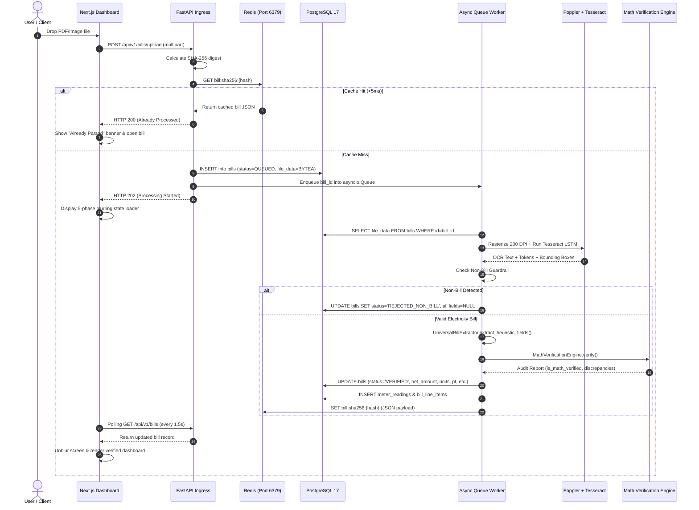

# JouleWise System Architecture & Design Document (HLD / LLD)

This document details the high-level architecture (HLD), low-level component design (LLD), database schema, mathematical verification equations, and codebase mapping for the JouleWise utility bill extraction and audit platform.

---

## 1. High-Level Design (HLD)

### 1.1 Architectural Goals & Principles

1. **Sub-2.5s Deterministic Extraction**:
   Extract all critical metrics (Consumer Name, Account ID, Bill Number, Issue Date, Due Date, Active Energy Units, Power Factor, and Net Amount Due) with deterministic accuracy without relying on slow external LLM inference.
2. **Zero Local Disk Footprint (Enterprise Storage)**:
   Store every uploaded bill directly in PostgreSQL 17 as binary data (`LargeBinary` / `BYTEA`). No document binaries, temporary slices, or cached PDFs touch the application host's local disk.
3. **Sub-5ms Cache Resolution & Deduplication**:
   Every document is fingerprinted using cryptographic SHA-256 upon arrival. If the document was already audited, the full verified payload is returned from Redis in under 5ms, and the UI immediately opens the existing record.
4. **Document Guardrails & Rejection**:
   Prevent non-utility documents (meter register maps, user manuals, datasheets) from polluting financial models by detecting negative signatures and classifying them as `REJECTED_NON_BILL` with clean `null` parameters.
5. **Decoupled Progressive Summarization**:
   Core OCR and mathematical audits complete immediately. Plain-English narrative summaries are synthesized asynchronously via Gemini 2.5 Flash or local Ollama (Llama 3.2), falling back to instant deterministic templates if offline.

---

### 1.2 System Topology & Architecture Diagram

```mermaid
flowchart TD
    subgraph Client ["Client Layer (Next.js 16)"]
        UI[Monochrome Dashboard\npage.tsx]
        Drop[Dropzone Ingestion\nsingle / bulk]
        Viewer[PDF Streaming Viewer\nNative Embed]
    end

    subgraph Gateway ["API Gateway Layer (FastAPI)"]
        Router[API Router\napi/v1/endpoints/bills.py]
        Hasher[SHA-256 Digest Generator]
    end

    subgraph Cache ["In-Memory Caching (Redis 7)"]
        RedisDB[(Redis Cache\nKey: bill:sha256:hash)]
    end

    subgraph Storage ["Persistent Storage (PostgreSQL 17)"]
        PG[(PostgreSQL 17 DB\nbills: BYTEA Blobs\nmeter_readings\nbill_line_items)]
    end

    subgraph Worker ["Async Pipeline (asyncio.Queue)"]
        Q[In-Memory Task Queue\napp/workers/queue.py]
        Poppler[Poppler pdftoppm\n200 DPI Grayscale]
        Tesseract[Tesseract OCR 5\nNeural LSTM OEM 1]
        Guardrail{Non-Bill Guardrail\nvalidate_is_electricity_bill}
        Parser[Universal Bill Extractor\nparse_fast]
        AuditEngine[Math Audit Engine\nverify]
        Summarizer[Progressive AI Summarizer\nGemini 2.5 / Ollama]
    end

    %% Flow connections
    Drop -->|Multipart POST| Router
    Router --> Hasher
    Hasher -->|Lookup SHA-256| RedisDB
    RedisDB -->|Cache Hit <5ms| Router
    Hasher -->|Cache Miss| PG
    PG -->|Enqueue UUID| Q
    Q --> Poppler
    Poppler --> Tesseract
    Tesseract --> Guardrail
    Guardrail -->|Rejected| PG
    Guardrail -->|Valid Bill| Parser
    Parser --> AuditEngine
    AuditEngine -->|Persist Verified Data| PG
    AuditEngine -->|Write Cache Payload| RedisDB
    AuditEngine -.->|Async Background Task| Summarizer
    Summarizer -.->|Enrich Summary| PG
    Viewer -->|GET /bills/{id}/file| Router
    Router -->|Stream BYTEA StreamResponse| PG
```

---

### 1.3 End-to-End Processing Sequence



---

## 2. Codebase Map: Subsystems, Files & Functions

This table maps every layer of the system to its exact file location and core functions:

| System Layer | Subsystem / Feature | File Path | Core Function / Class | Responsibility |
| :--- | :--- | :--- | :--- | :--- |
| **Ingress** | API Routing & Endpoints | `backend/app/api/v1/endpoints/bills.py` | `upload_bill()`, `bulk_upload_bills()` | Validates multipart files, hashes SHA-256, checks cache, enqueues work. |
| **Ingress** | Document Streaming | `backend/app/api/v1/endpoints/bills.py` | `get_bill_file()` | Streams document binary directly from PostgreSQL memory to client iframe. |
| **Ingress** | CSV Export Engine | `backend/app/api/v1/endpoints/bills.py` | `export_all_bills_csv()`, `export_single_bill_csv()` | Formats audited parameters to CSV; handles clean empty cells for non-bills. |
| **Storage** | Database ORM Models | `backend/app/models/bill.py` | `Bill`, `MeterReading`, `BillLineItem` | SQLAlchemy 2.0 models with nullable attributes and `BYTEA` storage. |
| **Caching** | Redis Caching Service | `backend/app/services/cache/redis_client.py` | `get_cached_bill()`, `set_cached_bill()`, `clear_all()` | Sub-5ms key-value retrieval, deletion, and full cache invalidation. |
| **Queue** | Background Worker | `backend/app/workers/queue.py` | `process_bill_task()`, `ProcessingQueue` | Picks queued bills, orchestrates OCR, guardrails, heuristics, and DB commit. |
| **OCR** | PDF Rasterizer & OCR | `backend/app/services/ocr/engine.py` | `DocumentOCREngine.extract()` | Poppler 4-thread 200 DPI conversion & single-pass Tesseract neural OCR. |
| **Extraction**| Document Guardrail | `backend/app/services/ocr/universal_extractor.py` | `validate_is_electricity_bill()` | Multi-keyword classifier rejecting datasheets/manuals as `REJECTED_NON_BILL`. |
| **Extraction**| Multi-DISCOM Parser | `backend/app/services/ocr/universal_extractor.py` | `extract_heuristic_fields()`, `parse_fast()` | Regex heuristics for APDCL, JVVNL, GESCOM (amounts, dates, units, PF). |
| **Audit** | Mathematical Audit | `backend/app/services/verification/engine.py` | `MathVerificationEngine.verify()` | Audits meter delta, multiplying factors, TOD sums, and power factor bounds. |
| **AI** | Progressive Summary | `backend/app/services/ocr/universal_extractor.py` | `generate_bill_summary_and_fallback()` | Background LLM enrichment (Gemini/Ollama) with deterministic fallback. |
| **Frontend** | Main UI & State Engine | `frontend-joulewise/app/page.tsx` | `handleFileUpload()`, `handleSelectBill()` | Pure CSS Module dashboard, file input reuse fix, and duplicate notices. |
| **Frontend** | Visual Stylesheet | `frontend-joulewise/app/page.module.css` | Monochrome Design Tokens | Apple-inspired `#fafafa` theme, screen-blurring loader, and tables. |

---

## 3. Low-Level Design (LLD)

### 3.1 Database Schema (PostgreSQL 17)

```sql
CREATE TABLE bills (
    id VARCHAR(36) PRIMARY KEY,
    discom_code VARCHAR(50) INDEX,
    discom_name VARCHAR(200),
    consumer_number VARCHAR(100) INDEX,
    account_number VARCHAR(100),
    consumer_name VARCHAR(255),
    billing_address TEXT,
    bill_number VARCHAR(100) INDEX,
    bill_date DATE,
    billing_period_start DATE,
    billing_period_end DATE,
    due_date DATE,
    tariff_category VARCHAR(100),
    sanctioned_load_kw FLOAT,
    contract_demand_kva FLOAT,
    billed_demand_kva FLOAT,
    power_factor FLOAT,
    total_units_kwh FLOAT,
    total_units_kvah FLOAT,
    total_current_charges FLOAT,
    net_amount_due FLOAT,
    amount_after_due_date FLOAT,
    file_data BYTEA NOT NULL,
    file_name VARCHAR(255) NOT NULL,
    mime_type VARCHAR(100) NOT NULL DEFAULT 'application/pdf',
    file_sha256 VARCHAR(64) NOT NULL INDEX,
    status VARCHAR(50) NOT NULL DEFAULT 'QUEUED' INDEX,
    is_valid_bill BOOLEAN NOT NULL DEFAULT TRUE,
    validation_error VARCHAR(500),
    bill_summary TEXT,
    confidence_score FLOAT NOT NULL DEFAULT 1.0,
    is_math_verified BOOLEAN NOT NULL DEFAULT FALSE,
    verification_details JSON,
    bounding_boxes JSON,
    raw_extracted_text TEXT,
    created_at TIMESTAMP WITH TIME ZONE NOT NULL,
    updated_at TIMESTAMP WITH TIME ZONE NOT NULL
);

CREATE TABLE meter_readings (
    id VARCHAR(36) PRIMARY KEY,
    bill_id VARCHAR(36) NOT NULL REFERENCES bills(id) ON DELETE CASCADE,
    meter_number VARCHAR(100) NOT NULL,
    reading_type VARCHAR(50) NOT NULL,
    previous_reading FLOAT NOT NULL,
    current_reading FLOAT NOT NULL,
    difference FLOAT NOT NULL,
    multiplying_factor FLOAT NOT NULL DEFAULT 1.0,
    consumed_units FLOAT NOT NULL,
    created_at TIMESTAMP WITH TIME ZONE NOT NULL,
    updated_at TIMESTAMP WITH TIME ZONE NOT NULL
);

CREATE TABLE bill_line_items (
    id VARCHAR(36) PRIMARY KEY,
    bill_id VARCHAR(36) NOT NULL REFERENCES bills(id) ON DELETE CASCADE,
    category VARCHAR(50) NOT NULL,
    description VARCHAR(255) NOT NULL,
    rate FLOAT,
    quantity FLOAT,
    amount FLOAT NOT NULL,
    created_at TIMESTAMP WITH TIME ZONE NOT NULL,
    updated_at TIMESTAMP WITH TIME ZONE NOT NULL
);
```

---

### 3.2 Mathematical Audit Formulation & Rules

The audit engine executes four deterministic mathematical reconciliation rules defined in `app/services/verification/engine.py`:

#### Rule 1: Meter Register Consumption Reconciliation
For every meter register $i \in \{1, \dots, n\}$:
$$\Delta_i = Current\_Reading_i - Previous\_Reading_i$$
$$Calculated\_Units_i = \Delta_i \times Multiplying\_Factor_i$$
$$\text{Audit Check: } |Calculated\_Units_i - Reported\_Units_i| \le \epsilon \quad (\epsilon = 1.0\text{ kWh})$$

#### Rule 2: Active Energy TOD Summation
When Time-of-Day registers (Solar, Peak, Normal) are present:
$$\text{Total Units} = \sum_{r \in \text{TOD}} Consumed\_Units_r \pm \epsilon$$

#### Rule 3: Power Factor Physics Bounds
$$\text{Valid PF Range: } 0.0 \le \text{Power Factor} \le 1.0 \quad (\text{or } 0.0\% \le \text{PF} \le 100.0\%)$$
Any value outside this physical bound triggers an immediate anomaly flag.

#### Rule 4: Date Chronology Invariant
$$\text{Period Start} \le \text{Period End} \le \text{Bill Date} \le \text{Due Date}$$

---

### 3.3 Multi-DISCOM Heuristic Patterns

1. **Assam Power Distribution Company Limited (APDCL)**:
   - **TOD Registers**: Parses `Solar | Peak | Normal` columns and sums into `total_units_kwh`.
   - **Financial Total**: Extracts `Grand Total` or `Say Rs. XXXXXX`.
   - **Power Factor**: Captures `Power Factor: 99.00`.
2. **Jaipur Vidyut Vitran Nigam Limited (JVVNL)**:
   - **Net Payable Amount**: Looks for final net amount directly preceding the Indian Rupees in words (*"Five Lakh Eighty Five Thousand Two Hundred Seventeen Rupees Only"* $\to$ `₹585,217`), preventing confusion with intermediate subtotals like `NET ND` (`₹550,624`).
   - **Average Power Factor**: Matches multi-line tabular header `Av. P.F` to value row `0.990`.
   - **Dates**: Resolves 3-date block: Reading Date, Bill Date (`04-Aug-2025`), and Due Date (`14-Aug-2025`).
3. **Gulbarga Electricity Supply Company Limited (GESCOM)**:
   - **Bill / Dispatch Reference**: Extracts `No:CNL/AEE/SA/25-26/`.
   - **Bill Date**: Targets signature date `Date: 03.07.2025` rather than plant commissioning date `Date of Service: 03.03.2012`.
   - **Due Date**: Normalizes ordinal words (*"16th of July"*) against billing year $2025 \to$ `2025-07-16`.

---

## 4. Test Suite Verification Metrics

JouleWise features 12 automated unit and integration tests executed with `pytest`:

```text
tests/test_api.py::test_health_check_endpoint PASSED              [  8%]
tests/test_api.py::test_discoms_endpoint PASSED                   [ 16%]
tests/test_api.py::test_settings_endpoints PASSED                 [ 25%]
tests/test_api.py::test_bill_upload_and_stream PASSED             [ 33%]
tests/test_math_verification.py::test_units_consistency_valid PASSED [ 41%]
tests/test_math_verification.py::test_units_consistency_mismatch_detected PASSED [ 50%]
tests/test_math_verification.py::test_power_factor_invalid PASSED [ 58%]
tests/test_parsers.py::test_extract_apdcl_scnel_bill PASSED       [ 66%]
tests/test_parsers.py::test_extract_apdcl_bill PASSED             [ 75%]
tests/test_parsers.py::test_extract_jvvnl_bill PASSED             [ 83%]
tests/test_parsers.py::test_extract_scanned_gescom_bill PASSED    [ 91%]
tests/test_parsers.py::test_non_bill_guardrail_rejection PASSED   [100%]

============================= 12 passed in 29.51s ==============================
```
