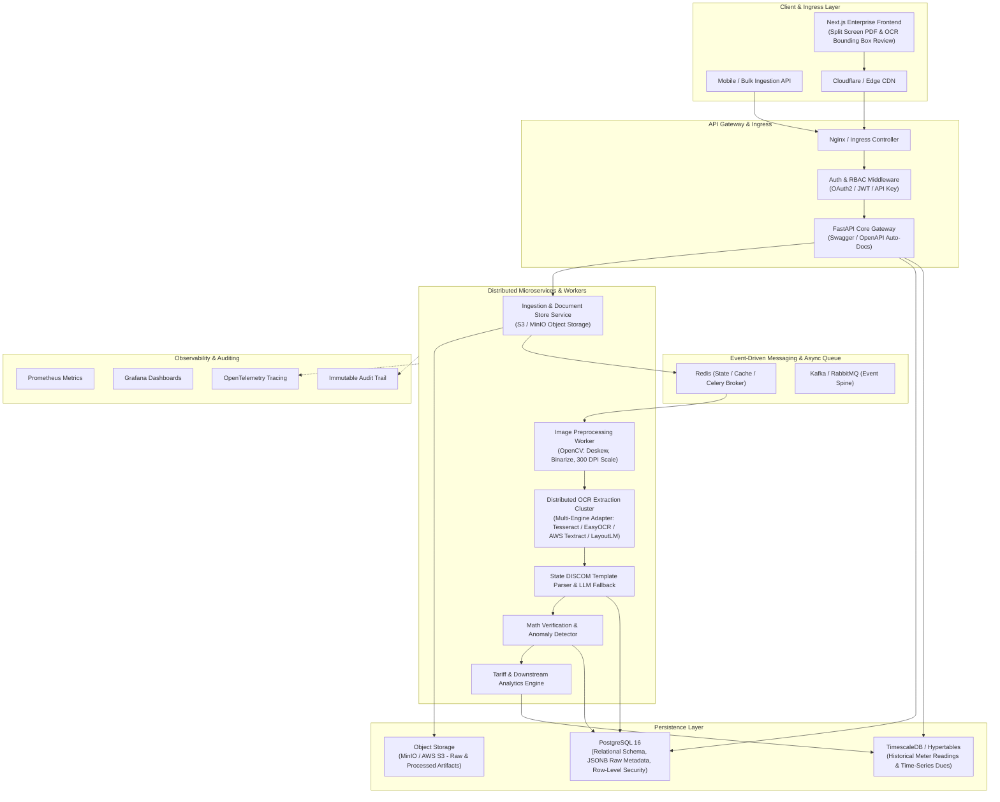
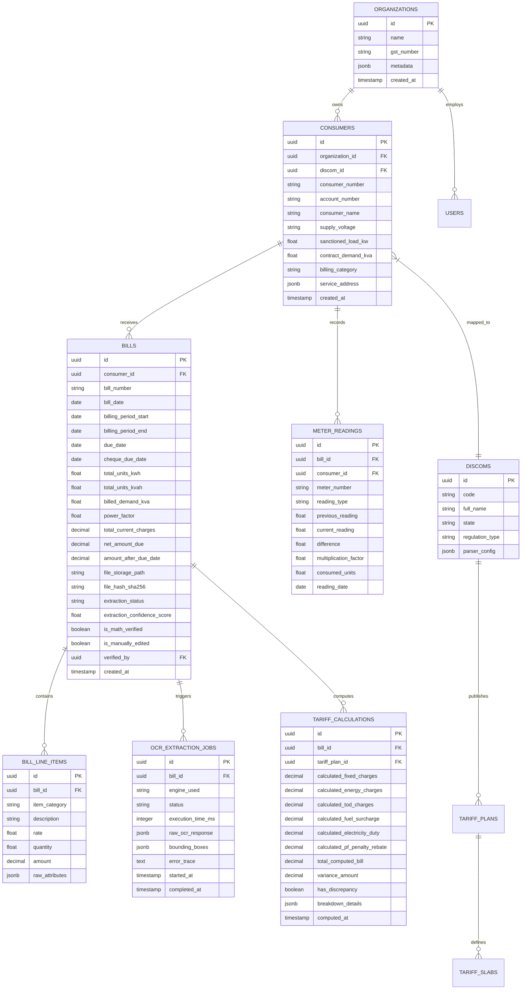
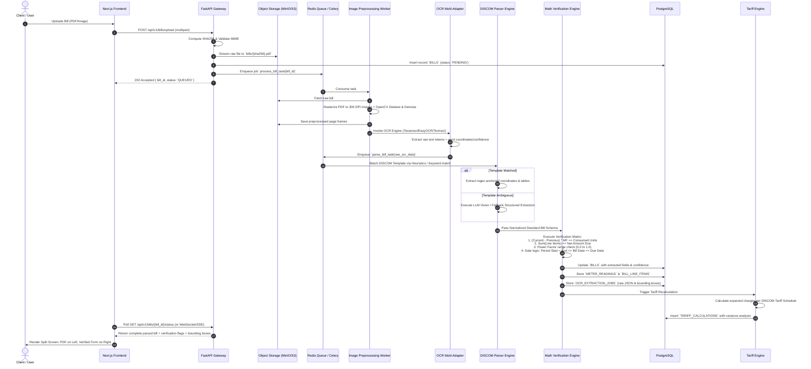
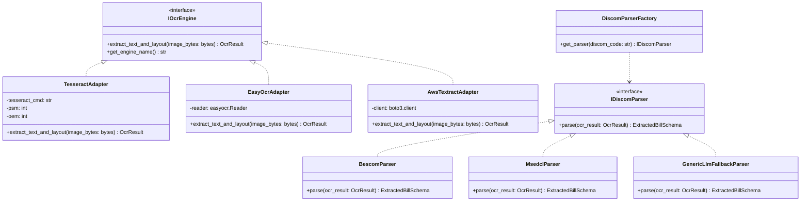

# JouleWise: Enterprise State Electricity Bill OCR & Tariff Automation Engine
## Complete Architecture Document (High-Level Design & Low-Level Design)

---

## 1. Executive Summary & System Vision

**JouleWise** is an enterprise-grade automated data ingestion, OCR extraction, document parsing, mathematical verification, and tariff calculation platform designed for industrial and commercial electricity consumers across diverse Indian State Electricity Distribution Companies (DISCOMs / State Electricity Boards).

### 1.1 Core Problems Solved
1. **Manual Entry Overhead & Human Error**: Eliminates manual keying of complex utility bills.
2. **Structural & Format Variance**: Handles diverse layout formats (scanned PDFs, high-res digital PDFs, multi-page image bills, dot-matrix printed bills) across state boards (e.g., BESCOM, MSEDCL, TANGEDCO, UPPCL, WBSEDCL, Tata Power, Adani Electricity).
3. **Bill Validation & Math Reconciliation**: Automatically validates $Total\ Units = (Current\ Reading - Previous\ Reading) \times Multiplier$, Power Factor penalties, MD (Maximum Demand) charges, TOD (Time of Day) slabs, and net dues.
4. **Downstream Tariff Analytics**: Computes true cost-per-unit, flags billing discrepancies or tariff category mismatches, and facilitates energy optimization.

---

## 2. High-Level Design (HLD)

### 2.1 System Context & Architecture Overview



### 2.2 Key Microservices & Functional Boundaries

| Component | Responsibility | Tech Stack |
| :--- | :--- | :--- |
| **Frontend Web App** | Upload dashboard, dual-pane PDF viewer + interactive bounding box editor, analytics, tariff simulator | Next.js 16 (App Router), React 19, TypeScript, TailwindCSS, Zustand, React-Query, Cypress |
| **API Gateway & Core API** | Client authentication, bill upload orchestration, sync query endpoints, export APIs, Swagger docs | Python 3.11+, FastAPI, Pydantic v2, Uvicorn, Dependency Injector |
| **Ingestion Service** | File validation (MIME, SHA256 deduplication, antivirus scan), upload to MinIO/S3, presigned URLs | FastAPI, `aiobotocore` / `boto3`, `python-magic` |
| **Async Processing Engine** | Orchestrates asynchronous multi-step processing pipeline with retry policies and DLQ | Celery + Redis / RabbitMQ / ARQ |
| **Vision & Preprocessing Engine** | PDF rasterization, rotation detection, deskewing, noise filtering, adaptive thresholding | `PyMuPDF` (fitz), `pdf2image`, `OpenCV` (cv2), `Pillow` |
| **Multi-Engine OCR Adapter** | Pluggable OCR engine execution (local open-source vs. cloud AI) with confidence scoring | `pytesseract`, `easyocr`, `boto3` (Textract), `surya-ocr` |
| **Parsing & Extraction Engine** | Rule-based regex matcher, state-specific layout coordinate parsers, and LLM fallback (Structured JSON) | `Pydantic`, `Instructor` / `OpenAI` / `Ollama` / `LangChain` |
| **Math Verification Engine** | Deterministic unit consistency checks, multiplier validations, penalty & tax checks | Pure Python Math Engine, `Sympy` |
| **Tariff Engine** | Dynamic DISCOM tariff rules evaluation, TOD slab computation, power factor rebate/penalty calculation | Python Tariff Rule Engine, dynamic config-driven formulas |
| **Persistence & Time-Series** | ACID relational storage, raw JSON extraction payloads, time-series consumption tracking | PostgreSQL 16, TimescaleDB, Alembic |

---

## 3. Low-Level Design (LLD)

### 3.1 Database Schema (ERD & Data Dictionary)



---

### 3.2 OCR & Extraction Processing Pipeline



---

### 3.3 Core Domain Contracts (Pydantic Models)

#### 3.3.1 Standardized Bill Schema (`StandardElectricityBill`)
```python
from decimal import Decimal
from datetime import date
from typing import List, Optional, Dict, Any
from pydantic import BaseModel, Field, field_validator

class MeterReadingItem(BaseModel):
    meter_number: str
    reading_type: str = Field(description="kWh, kVAh, kW_MD, kVA_MD, TOD1, TOD2, etc.")
    previous_reading: float
    current_reading: float
    difference: float
    multiplying_factor: float = 1.0
    total_units: float
    reading_date: Optional[date] = None

    @field_validator("difference", mode="before")
    @classmethod
    def compute_difference(cls, v, values):
        # Auto-compute if missing
        return v

class BillLineItem(BaseModel):
    category: str = Field(description="FIXED_CHARGE, ENERGY_CHARGE, TOD_SURCHARGE, TAX, PENALTY, REBATE")
    description: str
    rate: Optional[float] = None
    quantity: Optional[float] = None
    amount: Decimal

class ExtractedBillSchema(BaseModel):
    discom_name: str
    consumer_number: str
    account_number: Optional[str] = None
    consumer_name: str
    billing_address: Optional[str] = None
    sanctioned_load_kw: Optional[float] = None
    contract_demand_kva: Optional[float] = None
    tariff_category: str
    supply_voltage_kv: Optional[float] = None
    power_factor: Optional[float] = None

    # Billing Period
    bill_number: str
    bill_date: date
    billing_period_start: date
    billing_period_end: date
    due_date: date
    cheque_due_date: Optional[date] = None

    # Consumption & Readings
    meter_readings: List[MeterReadingItem]
    billed_demand_kva: Optional[float] = None
    total_consumed_units_kwh: float
    total_consumed_units_kvah: Optional[float] = None

    # Financial Breakdown
    line_items: List[BillLineItem]
    total_current_charges: Decimal
    arrears_amount: Decimal = Decimal("0.00")
    adjustments_or_rebates: Decimal = Decimal("0.00")
    net_amount_due: Decimal
    amount_payable_after_due_date: Optional[Decimal] = None

    # Metadata & Auditing
    ocr_confidence_score: float = Field(ge=0.0, le=1.0)
    bounding_boxes: Optional[Dict[str, Any]] = None
```

---

### 3.4 Math Verification Rules Engine

The mathematical consistency engine runs automated sanity checks before saving or notifying the user:

$$\Delta_{\text{units}} = (\text{Current Reading} - \text{Previous Reading}) \times \text{Multiplying Factor}$$
$$\text{Units Error} = |\Delta_{\text{units}} - \text{Reported Consumed Units}| \le \epsilon \quad (\epsilon = 0.05)$$

$$\text{Financial Reconciliation} = \left| \sum (\text{Line Items}) + \text{Arrears} - \text{Rebates} - \text{Net Amount Due} \right| \le 1.00$$

$$\text{Power Factor Check} = 0.0 \le \text{Power Factor} \le 1.0$$

$$\text{Date Ordering} = \text{Period Start} < \text{Period End} \le \text{Bill Date} \le \text{Due Date}$$

If any rule fails, the bill status is marked `FLAGGED_FOR_REVIEW` with granular error codes (e.g. `ERR_MATH_UNITS_MISMATCH`, `ERR_DATE_SEQUENCE_INVALID`, `ERR_SUM_TOTAL_DISCREPANCY`).

---

### 3.5 Pluggable Multi-Engine OCR Architecture (GoF Strategy / Adapter Pattern)



---

## 4. Frontend Architecture & Enterprise UX

### 4.1 UI Component Architecture

```
frontend-joulewise/
├── app/
│   ├── (auth)/
│   │   ├── login/
│   │   └── register/
│   ├── (dashboard)/
│   │   ├── bills/
│   │   │   ├── [id]/
│   │   │   │   ├── page.tsx            # Split-screen PDF viewer + OCR bounding box editor
│   │   │   │   └── ReviewEditor.tsx    # Live sync form with validation feedback
│   │   │   ├── upload/
│   │   │   │   ├── page.tsx            # Drag & drop multi-file zone with real-time progress
│   │   │   │   └── Dropzone.tsx
│   │   │   └── page.tsx                # Bill table list with filters, tags & status chips
│   │   ├── analytics/
│   │   │   └── page.tsx                # Consumption trends, TOD analytics, Tariff variance
│   │   ├── layout.tsx
│   │   └── page.tsx
│   ├── api/                            # Next.js BFF proxy (if needed)
│   ├── globals.css
│   └── layout.tsx
├── components/
│   ├── ui/                             # Base atomic components (Buttons, Inputs, Modals, Badges)
│   ├── pdf-viewer/                     # PDF Canvas renderer with interactive OCR bounding overlay
│   ├── bill-editor/                    # Form blocks: MeterReadingsTable, LineItemsTable, ConsumerHeader
│   └── analytics/                      # Highcharts / Recharts graphs for energy & tariff analysis
├── configs/                            # JSON/TS constants (DISCOMs list, Status codes, Error maps)
├── hooks/                              # Custom hooks (useBillUpload, useOcrSocket, useDebounce)
├── lib/                                # API clients (Axios instance, auth tokens, utilities)
├── types/                              # Strict TypeScript interfaces matching backend Pydantic models
└── cypress/                            # Cypress E2E test suites
```

### 4.2 Split-Screen Interactive Verification Interface

1. **Left Pane**: Interactive PDF/Image viewer with zoom, pan, rotate, and highlight bounding boxes corresponding to the hovered field in the form.
2. **Right Pane**: Structured, verified data form. Field inputs show confidence badges (Green > 90%, Yellow 70-90%, Red < 70%).
3. **Real-time Math Validation**: Editing the meter reading immediately recalculates consumed units and warns if mismatch occurs.
4. **Confirm & Commit**: One-click approval to transition status from `NEEDS_REVIEW` to `VERIFIED` and trigger downstream tariff calculations.

---

## 5. Security, Observability & Deployment Topology

### 5.1 Security
- **Upload Hardening**: File type verification via magic bytes, max size limits (25MB), sanitization of filenames, storage in private buckets with time-limited presigned URLs.
- **Data Protection**: Encryption at rest (AES-256 for S3 & PostgreSQL DB volume encryption), TLS 1.3 in transit.
- **Tenant Isolation**: Row-Level Security (RLS) on PostgreSQL tables using `organization_id`.

### 5.2 Observability & Reliability
- **Structured JSON Logging**: All services output structured JSON with `trace_id`, `span_id`, `bill_id`, `discom_id`.
- **Metrics**: Prometheus instrumentation tracking:
  - OCR processing latency per page.
  - OCR confidence distribution.
  - Extraction success rate vs. fallback rate.
  - Mathematical verification pass/fail ratio.
- **Dead Letter Queue (DLQ)**: Failed OCR tasks retry up to 3 times with exponential backoff before being routed to a DLQ for manual engineer inspection.

---
